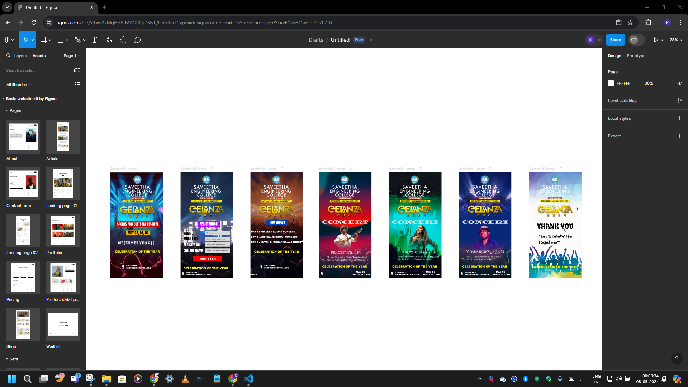

# Ex09 Event Registration Web Application

## Date : 08/05/2024

## AIM:
To design, develop and deploy a web application for event registration.

## DESIGN STEPS:

### Step 1:
Create a new frame.

### Step 2:
Select any one preset size of your choice.

### Step 3:
Select the shapes you need.

### Step 4:
Import images as needed.

### Step 5:
Create pages based on your need and link them.

### Step 6:

Validate the HTML and CSS code.

### Step 6:

Publish the website in the given URL.

## DESIGN TOOL:
Figma

## CODE:

Home Page 

```

```

Registration Page

```

```

Pro Shows Page

```
<div style="width: 518px; height: 1047px; position: relative; background: white">
  
  <div style="width: 470px; height: 64px; left: 36px; top: 770px; position: absolute; color: #FFF500; font-size: 28px; font-family: Archivo Black; font-weight: 400; word-wrap: break-word">CELEBRATION OF THE YEAR</div>
  <div style="width: 207px; height: 54px; left: 158px; top: 470px; position: absolute; background: #0040BD"></div>
  <div style="width: 163px; height: 31px; left: 189px; top: 470px; position: absolute; color: white; font-size: 35px; font-family: Anton; font-weight: 400; word-wrap: break-word">PRO SHOWS</div>
  
  <div style="width: 514px; height: 30px; left: 6px; top: 578px; position: absolute; color: white; font-size: 22px; font-family: Archivo Black; font-weight: 400; word-wrap: break-word">DAY 1 : PRADEEP KUMAR CONCERT </div>
  <div style="width: 514px; height: 30px; left: 4px; top: 629px; position: absolute; color: white; font-size: 22px; font-family: Archivo Black; font-weight: 400; word-wrap: break-word">DAY 2 : ANDREA JEREMIAH CONCERT </div>
  <div style="width: 514px; height: 30px; left: 6px; top: 680px; position: absolute; color: white; font-size: 22px; font-family: Archivo Black; font-weight: 400; word-wrap: break-word">DAY 3 : YUVAN SHANKAR RAJA CONCERT </div>
  
  <div style="left: 136px; top: 914px; position: absolute; color: white; font-size: 18px; font-family: Archivo Black; font-weight: 400; word-wrap: break-word">SAVEETHA 
  <br/>ENGINEERING COLLEGE</div>
  
</div>
```

Day 1 Concert Info Page

```
<div style="width: 518px; height: 1047px; position: relative; background: white">
  
  
  
  <div style="left: 365px; top: 972px; position: absolute; color: white; font-size: 22px; font-family: Archivo Black; font-weight: 400; word-wrap: break-word">MAY 02</div>
  <div style="left: 331px; top: 999px; position: absolute; color: white; font-size: 22px; font-family: Archivo Black; font-weight: 400; word-wrap: break-word">Starts at 7 PM</div>
  <div style="left: 119px; top: 768px; position: absolute; color: white; font-size: 30px; font-family: Charmonman; font-weight: 700; word-wrap: break-word">PRADEEP KUMAR</div>
  
  <div style="left: 80px; top: 825px; position: absolute; color: white; font-size: 20px; font-family: Cherry Swash; font-weight: 400; word-wrap: break-word">"Strings Strumming, Beats Reverberating: 
  <br/>Join the Unforgettable Musical Odyssey!"</div>
  <div style="left: 30px; top: 463px; position: absolute; color: #FFFAFA; font-size: 50px; font-family: Diplomata; font-weight: 400; word-wrap: break-word">CONCERT</div>
  
  <div style="width: 470px; height: 30px; left: 33px; top: 917px; position: absolute; color: #FFF500; font-size: 28px; font-family: Archivo Black; font-weight: 400; word-wrap: break-word">CELEBRATION OF THE YEAR</div>
</div>
```

Day 2 Concert Info Page

```
<div style="width: 518px; height: 1047px; position: relative; background: white">
  
  
  
  <div style="left: 365px; top: 972px; position: absolute; color: white; font-size: 22px; font-family: Archivo Black; font-weight: 400; word-wrap: break-word">MAY 03</div>
  <div style="left: 331px; top: 999px; position: absolute; color: white; font-size: 22px; font-family: Archivo Black; font-weight: 400; word-wrap: break-word">Starts at 7 PM</div>
  <div style="left: 129px; top: 765px; position: absolute; color: white; font-size: 30px; font-family: Charmonman; font-weight: 700; word-wrap: break-word">ANDREA JEREMIAH</div>
  <div style="left: 81px; top: 819px; position: absolute; color: white; font-size: 20px; font-family: Cherry Swash; font-weight: 400; word-wrap: break-word">"Guitars that Echo, Rhythms that Resonate: 
  <br/>Join Us for an Unforgettable Night!"</div>
  <div style="left: 30px; top: 463px; position: absolute; color: #FFFAFA; font-size: 50px; font-family: Diplomata; font-weight: 400; word-wrap: break-word">CONCERT</div>
  
  <div style="width: 470px; height: 30px; left: 33px; top: 917px; position: absolute; color: #FFF500; font-size: 28px; font-family: Archivo Black; font-weight: 400; word-wrap: break-word">CELEBRATION OF THE YEAR</div>
  <div style="left: 59px; top: 982px; position: absolute; color: white; font-size: 18px; font-family: Archivo Black; font-weight: 400; word-wrap: break-word">SAVEETHA 
  <br/>ENGINEERING COLLEGE</div>
  
</div>
```

Day 3 Concert Info Page

```

```

Thank You Page

```
<div style="width: 518px; height: 1047px; position: relative; background: white">
  
  
  
  <div style="left: 30px; top: 463px; position: absolute; color: #FFFAFA; font-size: 50px; font-family: Diplomata; font-weight: 400; word-wrap: break-word">CONCERT</div>
  <div style="width: 470px; height: 30px; left: 38px; top: 921px; position: absolute; color: #FFF500; font-size: 28px; font-family: Archivo Black; font-weight: 400; word-wrap: break-word">CELEBRATION OF THE YEAR</div>
  <div style="width: 380px; height: 66px; left: 78px; top: 491px; position: absolute; color: black; font-size: 70px; font-family: Fruktur; font-weight: 400; word-wrap: break-word">THANK YOU</div>
  <div style="width: 362px; height: 61px; left: 92px; top: 607px; position: absolute; color: black; font-size: 50px; font-family: Gochi Hand; font-weight: 400; word-wrap: break-word">“Let’s celebrate together”</div>
</div>
```

## OUTPUT:



## RESULT:
The program to design, develop and deploy a web application for event registration is completed successfully.
